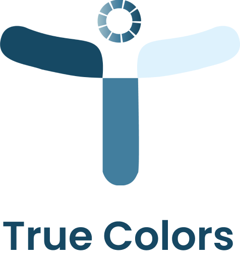

# True Colors

<p align="center">
  
</p>

_True Color: A Color Identification & Color Blindness Test App_ 🧑‍⚕️

## Description 📱

True Color is an Android app designed to help users identify colors and take a color blindness test. With a simple interface and useful features, this app is perfect for anyone who wants to test their ability to recognize colors.

## Features ⭐

### 1. Color Scan 📸
This feature enables users to scan the colors around them using their phone's camera and instantly get the name of the detected color.

### 2. Color Blindness Test 🧠
This feature provides a simple **Ishihara test** that can be used to identify potential difficulties in distinguishing certain colors. Users will be tested with a series of **Ishihara color patterns** designed to detect color blindness symptoms. The Ishihara test is a widely used method to detect color vision deficiencies, especially red-green color blindness.

## Technologies Used 🛠️

- **MVVM Architecture (Model-View-ViewModel)**  
  The app follows the MVVM architecture to ensure separation of concerns, making the code maintainable and scalable.

- **Kotlin**  
  Kotlin is the primary programming language used to develop the Android application.

- **Glide**  
  Glide is used for efficiently loading images and displaying high-performance graphics, particularly useful for handling color images.

- **XML**  
  XML is used for designing the user interface of the app.


## Installation ⚙️

1. Clone this repository to your local machine:
   ```bash
   git clone https://github.com/C242-PS126-Team/mobile-development.git
2. Open the project in Android Studio.
3. Build and run the application on an emulator or physical device.
